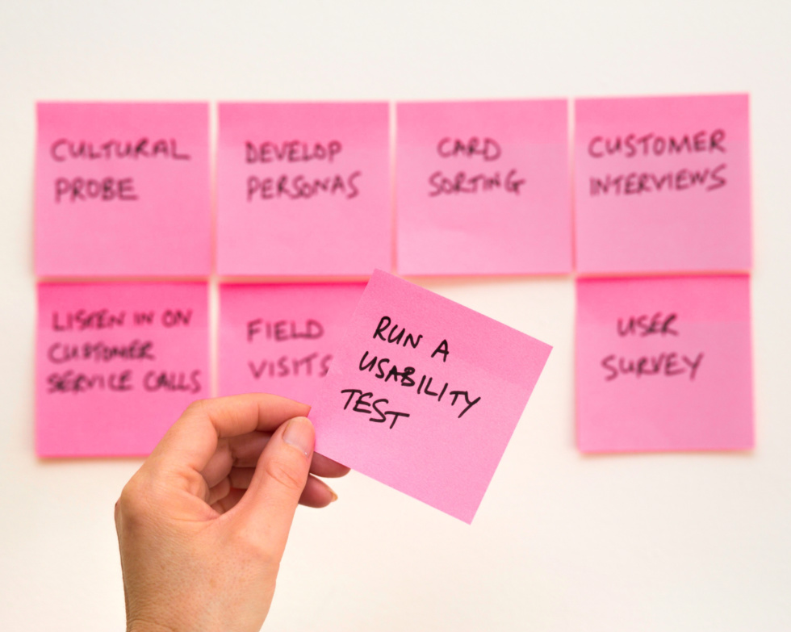
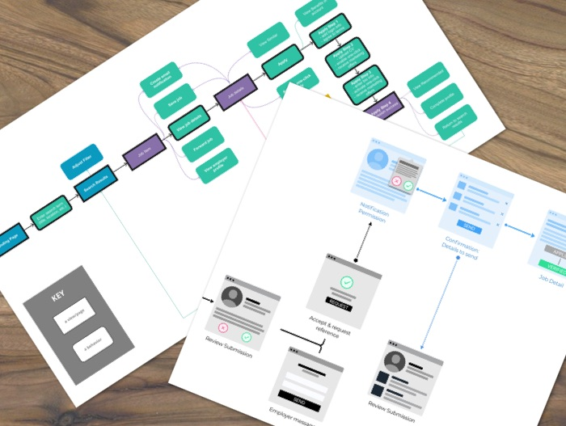
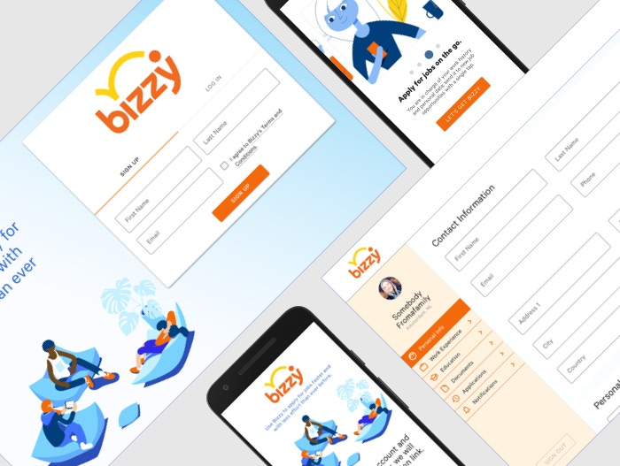

<!-- Main -->

<!-- One -->
<section id="one">
	

		<header class="major">
			<h2>Making the Blockchain accessible for BizzyLabs</h2>
		</header>
		
During the recent past, "Blockchain technology" is a term that's been floating around in a lot of people's conversations. At <a href="https://getbizzy.com">BizzyLabs</a>, we've been doing our best to leverage blockchain as more than just a buzzword, instead we are rolling out a platform that will establish a standard for communicating and maintaining career histories. As the UX Designer on this project, I identified a number of challenges:

		<ul>
			<li>Research the roles and features of competitors like Indeed, LinkedIn, and Glassdoor.</li>
			<li>Understand the current experience of job seekers that share and maintain career histories.</li>
			<li>Improve and innovate on the current experience of job seekers that share and maintain career histories.</li>
			<li>Devise flows and user interfaces that utilize the power of blockchain technology without surfacing its complexity.</li>
		</ul>
	

</section>

<!-- Two -->
<section id="two" class="spotlights">
	<section>
		<a class="image">
			
			Photo of UX post-its by David Travis (Unsplash)
		</a>
		

			

				<header class="major">
					<h3>Research</h3>
				</header>
				
Everyone on the team had been a job seeker; we all had subjective ideas about the best way to design this app. To avoid biased problem solving, a genuine research effort was required. I completed an <b>in-depth analysis of 15 direct and indirect competitors</b>using a spreadsheet to catalog and compare key features and brand aspects. Along with <b>job-seeker interviews conducted along with the Product Manager</b>, I was able to identify missed opportunities our app could address.

			

		

	</section>
	<section>
		<a class="image">
			
			A couple of renderings of my process artifacts
		</a>
		

			

				<header class="major">
					<h3>Flows and Diagrams</h3>
				</header>
				
After gathering a sense of what steps the job seeker goes through while maintaining their career histories, the next step was to chart and diagram those journeys to be able to investigate the kinds of interactions that we could optimize or innovate upon. Mapping out the <b>task flows of competitive apps</b> and building prospective <b>user journeys that our customers would experience</b> were key steps to getting firm design directions.

			

		

	</section>
	<section>
		
		

			

				<header class="major">
					<h3>Screen Designs</h3>
				</header>
				
Trends, patterns, and behavioral tendencies made clear through research informed my design decisions in the screen design phase. To produce designs quickly and take advantage of an extensive library of base elements, I've used Google's Material Design as a starting point. The true test of these designs' effectiveness will come when this product is put in front of a sufficient number of users. The app launch is imminent and I look forward to continuously learning and improving the way it works.

			

		

	</section>
</section>

