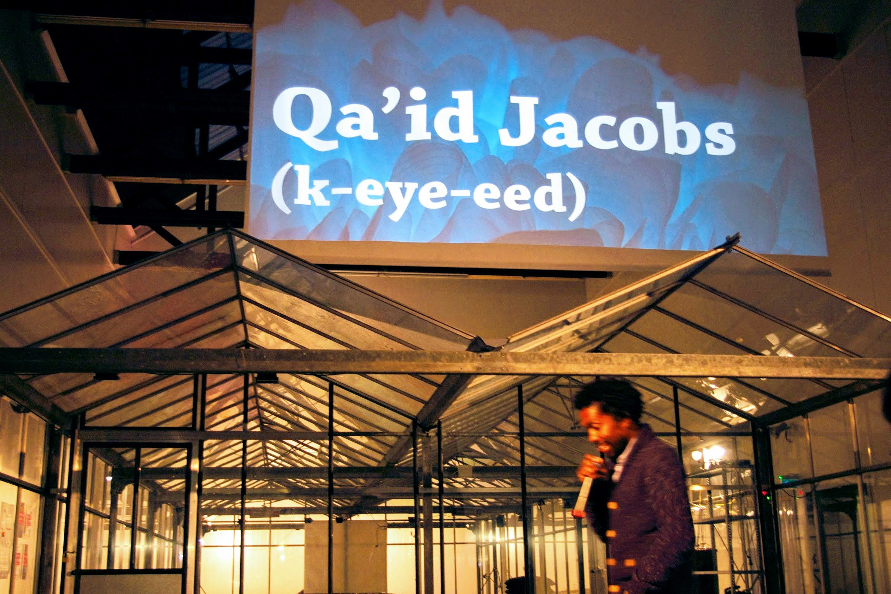

<!-- Main -->

<!-- One -->
<section id="one">
	

		<header class="major">
			<h1>Public Speaking for Provocative Thinking</h1>
		</header>

		

			

				
			

			

				<h3>Bitten by the bug</h3>
				<h4 class="small-header-subtitle">(2014 - Mediamatic, Amsterdam)</h4>
				
I caught the public speaking bug in 2014 when I took part in a night of Ignite presentations at <a href="https://www.mediamatic.net/en/page/66770/geert-wilders-arts-benefit-to-society">Mediamatic in Amsterdam</a>. Ignite presentations last for only 5 minutes, and the hook is that your visual presentation runs without stop; these presentations turn out to be more like choreographed performances than anything else. That night I chose to tell the dramatic and true, love-and-near-death story of my honeymoon. It was challenging and fun! Afterwards I was excited to get back onto a stage to share more.

			

		

		

			

				<iframe width="560" height="315" src="https://www.youtube.com/embed/JHB7t8WWBdE" frameborder="0" allow="accelerometer; autoplay; encrypted-media; gyroscope; picture-in-picture" allowfullscreen></iframe>
			

			

				<h3>Honor Your Struggle by Hacking Corporate Culture</h3>
				<h4 class="small-header-subtitle">(2016 - AlterConf, Paris)</h4>
				
This presentation is a 4 part, UX-based strategy of Analysis, Destruction, (re)Design, and Adjustment tactics given at <a href="https://www.alterconf.com/conferences/2016/paris-france">AlterConf Paris 2016</a>. It's components are derived from the lived experience of thriving on the margins and challenging the status quo. Let's explore this strategy as a way to both bring our whole selves to work and produce excellent digital products at the same time. As marginalized people wanting to do our best technology and design work in impactful ways, we often find ourselves in corporate or company cultures that are designed for our failure and misery. Fighting for our personal survival in theses spaces is usually misunderstood by others as a fight that has nothing to do with the products and services we're trying to build. But how can an organization generate a truly successful product if the ENVIRONMENT in which it's made is actually designed for people's failure?
		
			

		

		

			

				<iframe width="560" height="315" src="https://www.youtube.com/embed/RO1ZYUdZmRc" frameborder="0" allow="accelerometer; autoplay; encrypted-media; gyroscope; picture-in-picture" allowfullscreen></iframe>
			

			

				<h3>Started from the Margins now we here</h3>
				<h4 class="small-header-subtitle">(2017 - AlterConf, London)</h4>
				
This presentation given at <a href="https://www.alterconf.com/conferences/2017/london-england">AlterConf London 2017</a>. In the tech and digital goods industry, successful products are often those made to be consumed by many, various people. How do we creators know what various people want? Empathy, that's how. This reality makes the skill of empathy powerful and sought after. In fact, EMPATHY is a superpower. Who has empathy in spades? Marginalized folks, that's who! Unable to celebrate our empathy advantage, most of us who are excluded from resources and opportunity have been forced to be empathetic in order to avoid being ostracized, impoverished, assaulted, or killed by those in positions of power. In this talk I explore the buzzword EMPATHY, and examine modern social structures that force the marginalized to be empathetic or die. Within this lens I will refocus a light on the way we can leverage our highly performing powers of empathy to combat those forces of marginalization responsible for the reluctant and conditional advantage of being disadvantaged.
		
			

		

		

			

				<iframe src="//www.slideshare.net/slideshow/embed_code/key/2RsqyokP6TPrJz" width="595" height="485" frameborder="0" marginwidth="0" marginheight="0" scrolling="no" style="border:1px solid #CCC; border-width:1px; margin-bottom:5px; max-width: 100%;" allowfullscreen> </iframe>
			

			

				<h3>Started from the Margins now we here: Harnessing the power of empathy</h3>
				<h4 class="small-header-subtitle">(2018 - Codemotion, Amsterdam)</h4>
				
This was an abbreviated and updated version of the 2017 presentation given at <a href="https://magazine.codemotion.com/events/conferences/2018/2018-05-08/amsterdam-2018">Codemotion Amsterdam 2018</a>. Empathy is having a moment - as well it should. As a tool, it helps us digital product makers to understand what our users want and need. Even more, as a super power, Empathy has helped marginalized populations to survive exclusion and hardship. Join me for an examination into how empathy is earned, not learned - and how we can use this knowledge to truly embrace User-centered design and deliver real value in our products.
		
			

		

	

</section>

