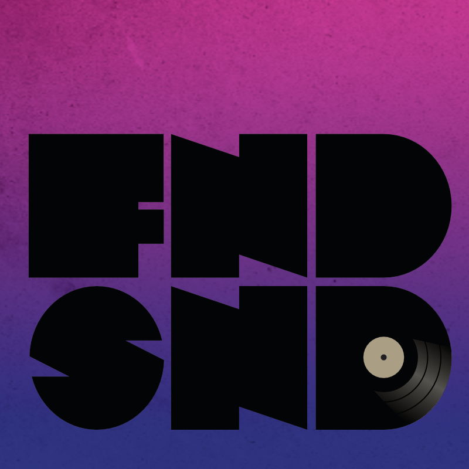
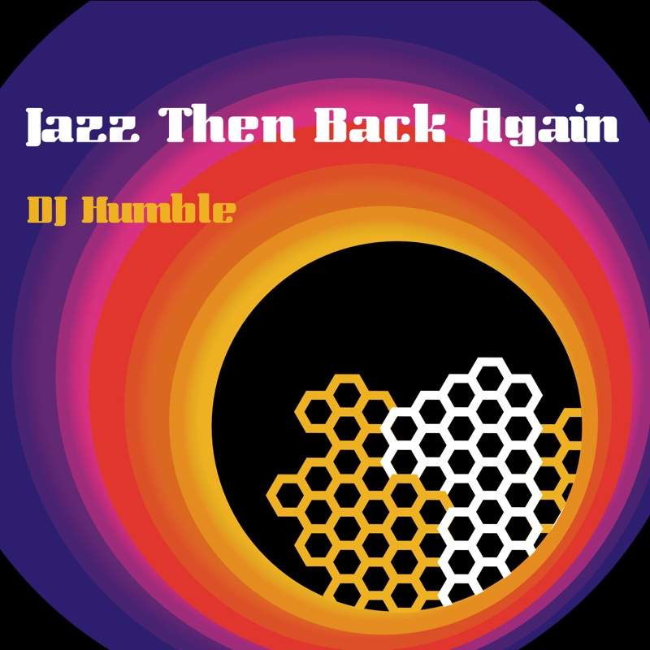
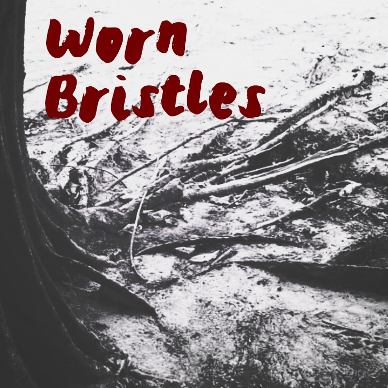

<!-- Main -->

<!-- One -->
<section id="one">
	

		<header class="major">
			<h1>Visual Design for Music Projects</h1>
		</header>

<!-- Content -->
<h2 id="content">Music in my blood</h2>

From mix-tapes to parties and concerts, my first impulse to design commercially came from the needs of music projects I've worked on.

<!-- Elements -->

	

<!-- Image -->
		

			

				

				

				

				<!-- Break -->
				

				

			

		

	

</section>

