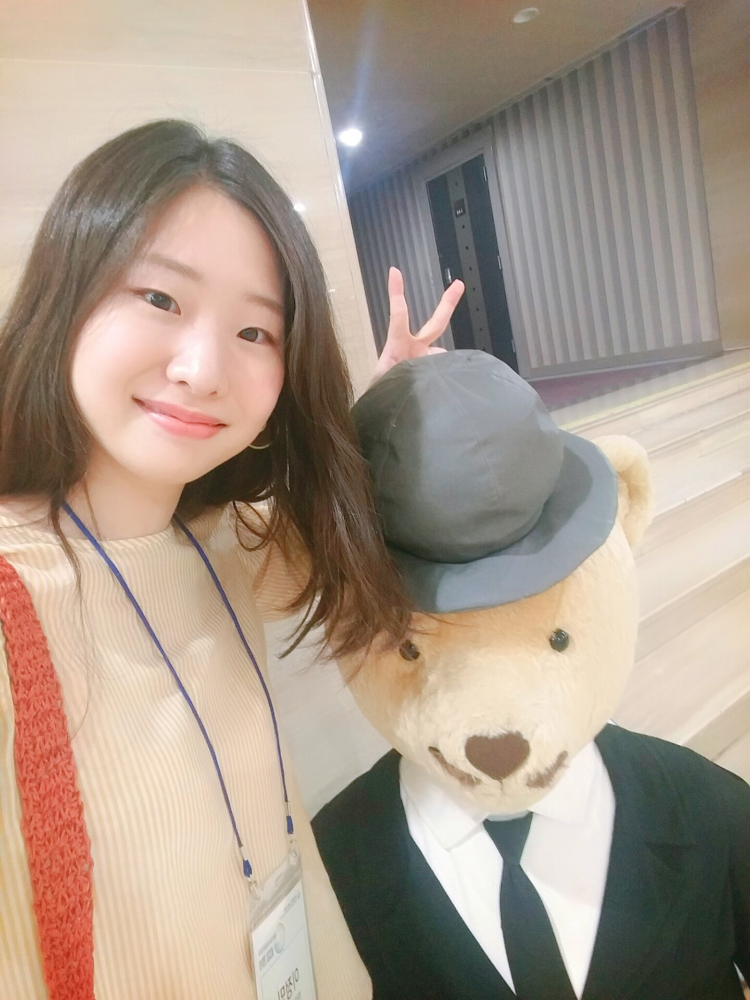

<!-- One -->
<section id="one">
	

<!-- Content -->

<h2>Professor</h2>

	

	

		
		<b><a href="people/yoonsang-lee.html">Yoonsang Lee</a></b>
		이윤상 
		yoonsanglee@hanyang.ac.kr 
	

	

<h2>MS Students</h2>

	

	

		
		<b><a href ="people/geuntae-park.html">Geuntae Park</a></b>
		박근태 
		qkrrmsxo01@hanyang.ac.kr
	

	

	

	

		
		<b><a href="people/chaejun-sohn.html">Chaejun Sohn</a></b>
		손채준 
		thscowns@gmail.com
	

	

	

	

		
		<b><a href="people/jeongmin-lee.html">Jeongmin Lee</a></b>
		이정민 
	    j0064423@hanyang.ac.kr	
	

	

	

	

		
		<b><a href="people/minkwan-kim.html">Minkwan Kim</a></b>
		김민관 
	    palkan21@hanyang.ac.kr	
	

	

</section>
