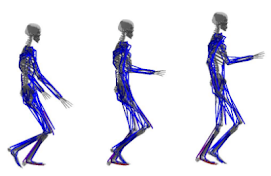

<section id="one">

<a href="publications/2018-iguana-ctrl.html"><b>Control of an Iguana Character Using Soft-Body Simulation</b></a> 
Taesoo Kwon, Hoimin Kim, Yoonsang Lee 
IEEE Access, Volume 6 Issue 1, Dec 2018 

<a href="publications/2017-perf-based.html"><b>Performance-Based Biped Control using a Consumer Depth Camera</b></a> 
Yoonsang Lee, Taesoo Kwon 
Computer Graphics Forum (Eurographics 2017), Volume 36 Issue 2, 387-395, May 2017 

<a href="publications/2015-push-recovery.html"><b>Push-Recovery Stability of Biped Locomotion</b></a> 
Yoonsang Lee, Kyungho Lee, Soon-Sun Kwon, Jiwon Jeong, Carol O'Sullivan, Moon Seok Park, Jehee Lee 
ACM Transactions on Graphics (SIGGRAPH Asia 2015), Volume 34 Issue 6, Article No. 180, November 2015 

<a href="publications/2014-many-muscle.html"><b>Locomotion Control for Many-Muscle Humanoids</b></a> 
Yoonsang Lee, Moon Seok Park, Taesoo Kwon, Jehee Lee 
ACM Transactions on Graphics (SIGGRAPH Asia 2014), Volume 33 Issue 6, Article No. 218, November 2014  

<a href="publications/2010-data-driven.html"><b>Data-Driven Biped Control</b></a> 
Yoonsang Lee, Sungeun Kim, Jehee Lee 
ACM Transactions on Graphics (SIGGRAPH 2010), Volume 29 Issue 4, Article No. 129, July 2010 

</section>
