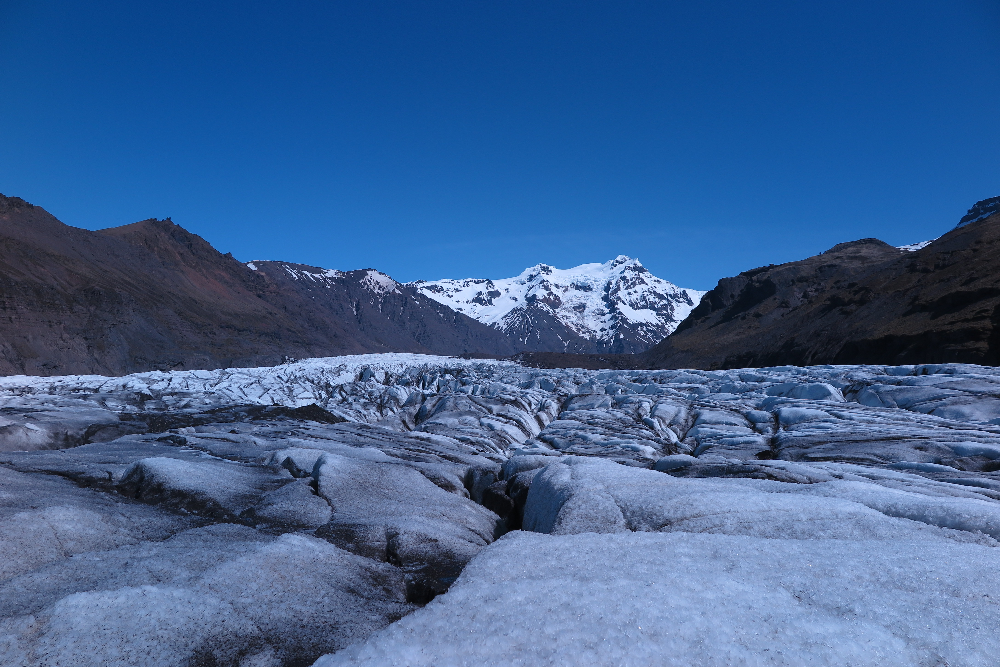
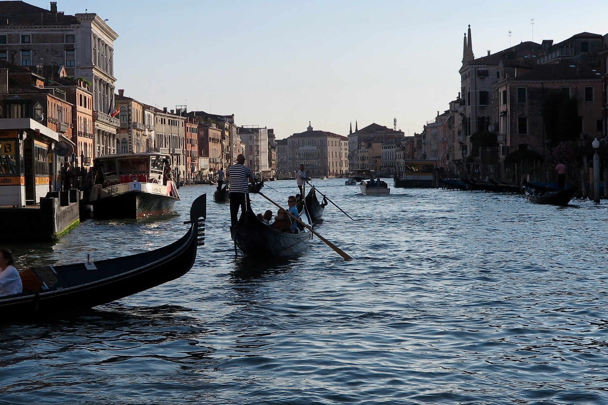

<!-- Main -->

<!-- One -->
<section id="one">
	

		<header class="major">
			<h2>Random things about myself</h2>
		</header>
		
Born and grown up in Taiwan. Now study abroad in the US. Beyond academia, I am an intensive badminton player. Here are some of my footprints.

	

</section>

<!-- Two -->
<section id="two" class="spotlights">
	<section>
		
		

			

				<header class="major">
					<h3>Travel to Tokyo, Japan</h3>
				</header>
				
Asakusa retains the vibe of an older Tokyo, with traditional craft shops and street-food stalls along Nakamise Street near the ancient Sensō-ji temple.

			

		

	</section>
	<section>
		
		

			

				<header class="major">
					<h3>Iceland circle trip</h3>
				</header>
				
Spend two weeks on this beautiful country. Walking about 4 hours on the glacier 

			

		

	</section>
	<section>
		
		

			

				<header class="major">
					<h3>Summer School in Italy</h3>
				</header>
				
I was fortunate to be selected to participate in the "2nd ICTP summer school on theory, mechanisms and hierarchical modeling of climate dynamics: convective organization and climate sensitivity" at the International Center for Theoretical Physics in Trieste, Italy. During the stay there, I  not only learned from several outstanding senior scientists but also met bright early-career scientists.

			

		

	</section>
</section>

<!-- Three -->
<section id="three">
	

		<header class="major">
			<h2>Wondering</h2>
		</header>
		
The euphonious harmonies equal to composite waves which blend different frequencies, wavelengths as well as wave patterns from different instruments perfectly together. Similar physical processes also occur in weather and climate phenomena; various oscillations with different frequencies fluctuate simultaneously, mutually fortifying or weakening each other, and then causing unexpected consequences.

		<ul class="actions">
			<li><a href="bpublication.html" class="button next">Get Started</a></li>
		</ul>
	

</section>

