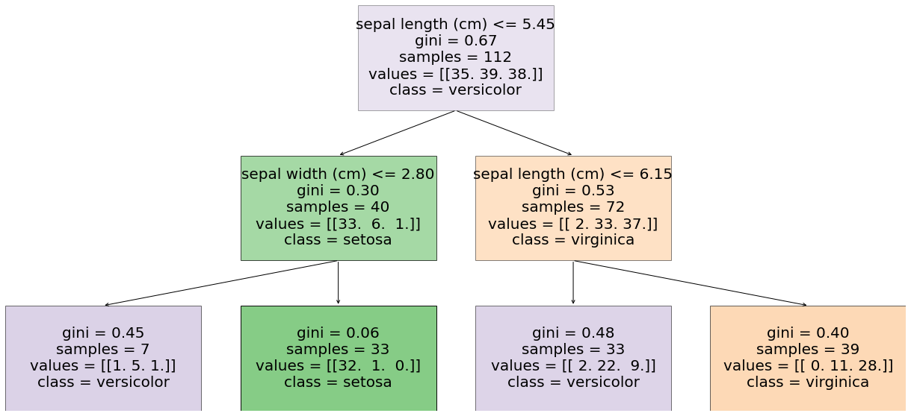

 <br>

## Create a decision tree model with only the numpy package.

If your involved with Data Science then you most likely have worked with or have come across a Decision Trees.  Decision Trees are regularly used algorithms that take on a 'tree' like form to assist in making predictions for both regression and classification, the models are decently simple, easy to visualize, and in more advanced models they can show great performance on complex data.  SKlearn has one of the more commonly used Decision Trees and makes it pretty simple to set up and run with the correct data.  

 <br>
(Decision Trees example.)

Decision Trees split data sets into smaller subsets while simultaneously making calculations and predictions on the data. The final product 
is a 'tree' looking structure that containing different types of 'nodes'.  The top node is the 'root' node, the bottom nodes are the 'leaf/terminal' nodes,
and the nodes in-between are 'decision' nodes.

I myself enjoy learning about how things work and how they are built so to create a Decision Tree from scratch in Python and not use the prebuilt SKlearn model 
seemed quite challenging but also very interesting.  My goal is not to beat the SKlearn model but to learn and understand how it all works behind the scene.

#### Necessary installs.
```
!pip install dtreeplt
```

#### Necessary imports.
```
import numpy as np
from sklearn.tree import DecisionTreeClassifier
from sklearn.model_selection import train_test_split
from sklearn.datasets import load_iris
from dtreeplt import dtreeplt
```

#### What are the necessary elements in a Decision Trees?
#### This Decision Tree contains methods for:
##### - fit
##### - gini impurity
##### - terminal node
##### - splits
##### - best split
##### - split branch
##### - build tree
##### - node predictor
##### - accuracy score

#### Decision Tree Class.
```
class DecisionTree(object):
    def __init__(self, max_depth, min_splits):
        self.max_depth = max_depth
        self.min_splits = min_splits
```

#### Fit Method.
##### Fitting is a measure of how well a model generalizes to similar data to that on which it was trained. A model that is well-fitted produces more accurate outcomes. A model that is overfitted matches the data too closely. A model that is underfitted doesn't match closely enough.
```
  def fit(self, feature, label):
      self.feature = feature
      self.label = label
      self.train_data = np.column_stack((self.feature,self.label))
      self.build_tree()
```

#### Gini Impurity Method.
##### Gini Impurity tells us what is the probability of misclassifying an observation and is used in calculation of the split, the lower the gini score the better the split is.  Gini impurity is just one the many methods that can be used for calculations in a Decision Tree.
 <br>
(Gini index formula.)
```
  def gini(self, groups, class_labels):
      number_sample = sum([len(group) for group in groups])
      gini_score = 0

      for group in groups:
          size = float(len(group))

          if size == 0:
              continue
          score = 0.0

          for label in class_labels:
              porportion = (group[:,-1] == label).sum() / size
              score += porportion * porportion
          gini_score += (1.0 - score) * (size/number_sample)

      return gini_score
```

#### Terminal Node Method.
##### Terminal nodes (leaf nodes) are the final nodes that do not split further.
```
  def term_node(self, group):
          class_labels, count = np.unique(group[:,-1], return_counts= True)
          return class_labels[np.argmax(count)]
```

#### Split Method.
##### Splitting a node into two sub-nodes is called splitting. It happens at all nodes except leaf nodes (terminal nodes).
```
  def split(self, index, val, data):
          data_l = np.array([]).reshape(0,self.train_data.shape[1])
          data_r = np.array([]).reshape(0, self.train_data.shape[1])

          for row in data:
              if row[index] <= val:
                  data_l = np.vstack((data_l,row))
              if row[index] > val:
                  data_r = np.vstack((data_r, row))
          return data_l, data_r
```

#### Best Split Method.
##### Best split uses the gini score and initial split to check all the values of each attribute and calculates the cost of the split to find the best possible split.
```
  def best_split(self, data):
          class_labels = np.unique(data[:,-1])
          best_index = 999
          best_val = 999
          best_score = 999
          best_groups = None

          for i in range(data.shape[1]-1):
              for row in data:
                  groups = self.split(i, row[i], data)
                  gini_score = self.gini(groups,class_labels)

                  if gini_score < best_score:
                      best_index = i
                      best_val = row[i]
                      best_score = gini_score
                      best_groups = groups
          result = {}
          result['index'] = best_index
          result['val'] = best_val
          result['groups'] = best_groups
          return result
```

#### Recursive Split Method.
##### Recursive split recursively uses best split and terminal node on all groups creating either a new node or a a terminal node.
```
  def rec_split(self, node, depth):
          l_node , r_node = node['groups']
          del(node['groups'])

          if not isinstance(l_node,np.ndarray) or not isinstance(r_node,np.ndarray):
              node['left'] = self.term_node(l_node + r_node)
              node['right'] = self.term_node(l_node + r_node)
              return

          if depth >= self.max_depth:
              node['left'] = self.term_node(l_node)
              node['right'] = self.term_node(r_node)
              return

          if len(l_node) <= self.min_splits:
              node['left'] = self.term_node(l_node)
          else: # else
              node['left'] = self.best_split(l_node)
              self.rec_split(node['left'],depth + 1)

          if len(r_node) <= self.min_splits:
              node['right'] = self.term_node(r_node)
          else:
              node['right'] = self.best_split(r_node)
              self.rec_split(node['right'],depth + 1)
```

#### Build the Tree Method.
##### Build the tree starts at the root node, then uses the best split on itself recursively to construct the entire tree.
```
  def build_tree(self):
          self.root = self.best_split(self.train_data)
          self.rec_split(self.root, 1)
          return self.root
```

### Node Prediction Method.
#### Node prediction checks if the node is either a terminal value to be returned as the prediction, or if it is a dictionary node containing another level to be checked.
```
  def pred_(self, node, row):
          if row[node['index']] < node['val']:
              if isinstance(node['left'], dict):
                  return self.pred_(node['left'], row)
              else:
                  return node['left']

          else:
              if isinstance(node['right'],dict):
                  return self.pred_(node['right'],row)
              else:
                  return node['right']

  def pred(self, test_data):
          self.pred_label = np.array([])
          for i in test_data:
              self.pred_label = np.append(self.pred_label, self.pred_(self.root,i))

          return self.pred_label
```

#### Accuracy Score Method.
##### Accuracy score shows how well the model is working, its calculated by, the number of correct predictions divided by the total number predictions made.
 <br>
(Accuracy score function.)
```
def acc_score(pred, act):
    correct = 0
    pred_len = len(pred)
    for i in range(pred_len):
        if int(pred[i]) == act[i]:
            correct += 1
    return correct/pred_len
```

#### Decision Tree Models.
##### Models function loads the wanted data, and executes both the Scratch and SKlearn Decision Trees.
```
def models():
    iris = load_iris()
    feature = iris.data[:,:2]
    label = iris.target
    X_train, X_test, y_train, y_test = train_test_split(feature, label, random_state= 42)
    """
    ### Created Decision Tree Model ###
    """
    scratch_dt_model =  DecisionTree(max_depth = 2,
                                min_splits = 10)
    scratch_dt_model.fit(X_train, y_train)
    scratch_dt_model_pred = scratch_dt_model.pred(X_test)
    """
    ### Sklearn Decision Tree Model ###
    """
    sk_dt_model = DecisionTreeClassifier(max_depth= 2,
                                         min_samples_split= 10)
    sk_dt_model.fit(X_train, y_train)
    sk_dt_model_pred = sk_dt_model.predict(X_test)
    """
    ### Results ###
    """
    print("Scratch Model Accuracy : {0}".format(acc_score(scratch_dt_model_pred, y_test)))
    print("SK-Learn Model Accuracy : {0}".format(acc_score(sk_dt_model_pred, y_test)))
    print(list(zip(scratch_dt_model_pred, sk_dt_model_pred, y_test)))

if  __name__ == "__main__":
    models()
```

#### Scratch Model Accuracy vs SKlearn Model Accuracy.

(Prediction accuracy.)

#### Visualize the Scratch Decision Tree Model.
##### dtreeplt
```
dtree = dtreeplt()
dtree.view()
dtree.view(interactive=True)

iris = load_iris()
feature = iris.data[:,:2]
label = iris.target
X_train, X_test, y_train, y_test = train_test_split(feature, label, random_state= 42)

scratch_tree_model =  DecisionTree(max_depth = 2, min_splits = 10)
scratch_model = scratch_tree_model.fit(X_train, y_train)
scratch_tree_model_pred = scratch_tree_model.pred(X_test)

dtree = dtreeplt(
    model=scratch_model,
    feature_names=iris.feature_names,
    target_names=iris.target_names,
)

fig = dtree.view()
```

(Scratch model tree view.)

#### Visualize the SKlearn Decision Tree Model.
##### dtreeplt
```
dtree = dtreeplt()
dtree.view()
dtree.view(interactive=True)

iris = load_iris()
feature = iris.data[:,:2]
label = iris.target
X_train, X_test, y_train, y_test = train_test_split(feature, label, random_state= 42)
sk_dt_model = DecisionTreeClassifier(max_depth = 2, min_samples_split = 10)
sk_model = sk_dt_model.fit(X_train, y_train)
sk_dt_model_pred = sk_dt_model.predict(X_test)

dtree = dtreeplt(
    model=sk_model,
    feature_names=iris.feature_names,
    target_names=iris.target_names,
)

fig = dtree.view()
```

(SKlearn model tree view.)

#### Summary
Going into this project I did not truly understand what it meant to build from 'scratch' and was pretty optimistic that I would be able 
to accomplish the project.  What I have learned which is a lot, is that there is so much going on behind the scene of these Decision Tree algorithms 
that I did not know about.  Maybe I was naive but I did not realize the complexity involved in what was needed to get a Decision Tree functioning properly.  
If you are trying to develop a unique algorithm it makes sense to create one from scratch like this and start from there, but if you are just in need of 
quick results, using a pre built model like SKlearn is more more time efficient and a much simpler task.

Through this process I have gained a deep respect for those that are developing their own algorithms and in the future I hope that I will have the skillset 
to do this all on my own for more than just a Decision Tree.  I was banging my head against the wall for a while with this project but I am grateful to have 
learned the ins and outs of a Decision Tree's inner workings and have a better understanding of what building from scratch really entails.

Any suggestions or feedback is greatly appreciated, I am still learning and am always open to suggestions and comments.

GitHub link
[Link]({{'https://github.com/CVanchieri/CS-DataScience-BuildWeek1}})


---
[[<< Back]](https://cvanchieri.github.io/DSPortfolio/a_machinelearning.html)


