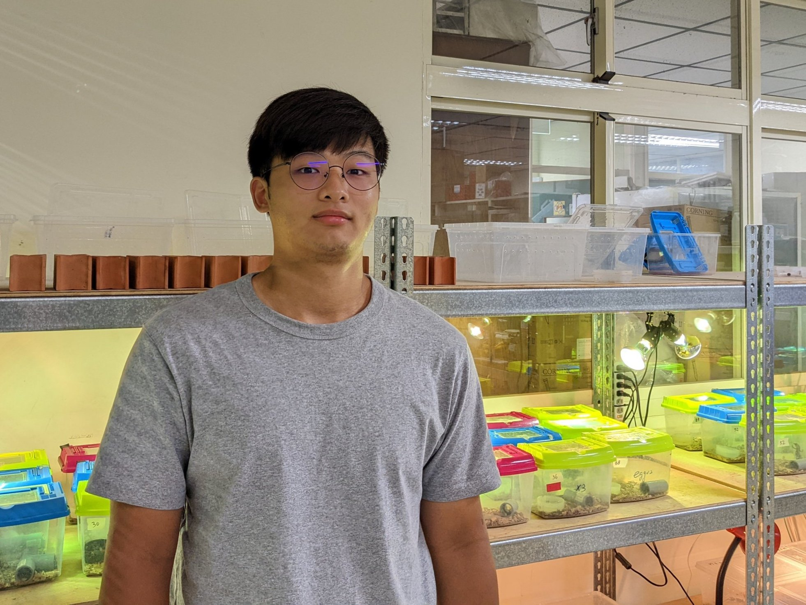
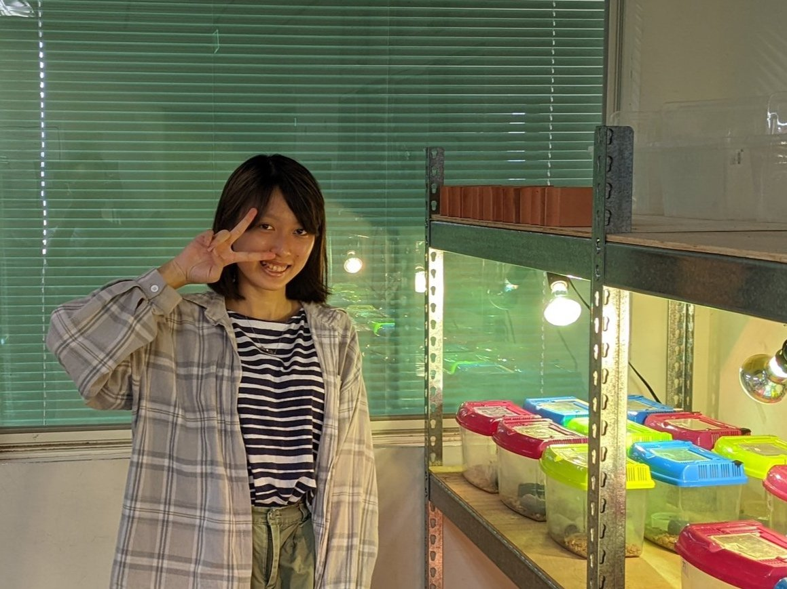

<section id="banner" class="style2">
  

  
  

  <header class="major">

# Landing

</header>
  

{{ page.description }}

</section>

  <section id="one">
  
<header class="major">

## Sed amet aliquam

</header>

Nullam et orci eu lorem consequat tincidunt vivamus et sagittis magna sed nunc rhoncus condimentum sem. In efficitur ligula tate urna. Maecenas massa vel lacinia pellentesque lorem ipsum dolor. Nullam et orci eu lorem consequat tincidunt. Vivamus et sagittis libero. Nullam et orci eu lorem consequat tincidunt vivamus et sagittis magna sed nunc rhoncus condimentum sem. In efficitur ligula tate urna.

  

</section>
  

  <section id="two" class="spotlights">
  <section>{:.image}

  
<header class="major">

### Orci maecenas

</header>

Nullam et orci eu lorem consequat tincidunt vivamus et sagittis magna sed nunc rhoncus condimentum sem. In efficitur ligula tate urna. Maecenas massa sed magna lacinia magna pellentesque lorem ipsum dolor. Nullam et orci eu lorem consequat tincidunt. Vivamus et sagittis tempus.

<em><a href="generic.html">Learn more</a>{:.button}

</em>

  <em></em>

</section>
  <em></em>
  <section>
  <em>{:.image}

</em>
  

  <em></em>
  
<em><header class="major">

### Rhoncus magna

</header>

Nullam et orci eu lorem consequat tincidunt vivamus et sagittis magna sed nunc rhoncus condimentum sem. In efficitur ligula tate urna. Maecenas massa sed magna lacinia magna pellentesque lorem ipsum dolor. Nullam et orci eu lorem consequat tincidunt. Vivamus et sagittis tempus.

</em>   <a href="generic.html">Learn more</a>{:.button}

</section>
  <section>{:.image}

  
<header class="major">

### Sed nunc ligula

</header>

Nullam et orci eu lorem consequat tincidunt vivamus et sagittis magna sed nunc rhoncus condimentum sem. In efficitur ligula tate urna. Maecenas massa sed magna lacinia magna pellentesque lorem ipsum dolor. Nullam et orci eu lorem consequat tincidunt. Vivamus et sagittis tempus.

<em><a href="generic.html">Learn more</a>{:.button}

</em>

  <em></em>

</section>
  <em>

</em>
</section>
  <em>
  

</em>
  <section id="three">
  <em></em>
  
<em><header class="major">

## Massa libero

</header>

Nullam et orci eu lorem consequat tincidunt vivamus et sagittis libero. Mauris aliquet magna magna sed nunc rhoncus pharetra. Pellentesque condimentum sem. In efficitur ligula tate urna. Maecenas laoreet massa vel lacinia pellentesque lorem ipsum dolor. Nullam et orci eu lorem consequat tincidunt. Vivamus et sagittis libero. Mauris aliquet magna magna sed nunc rhoncus amet pharetra et feugiat tempus.

</em>   <a href="generic.html">Get Started</a>{:.button .next}

</section>
  

