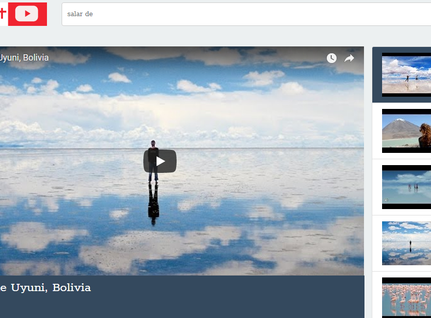
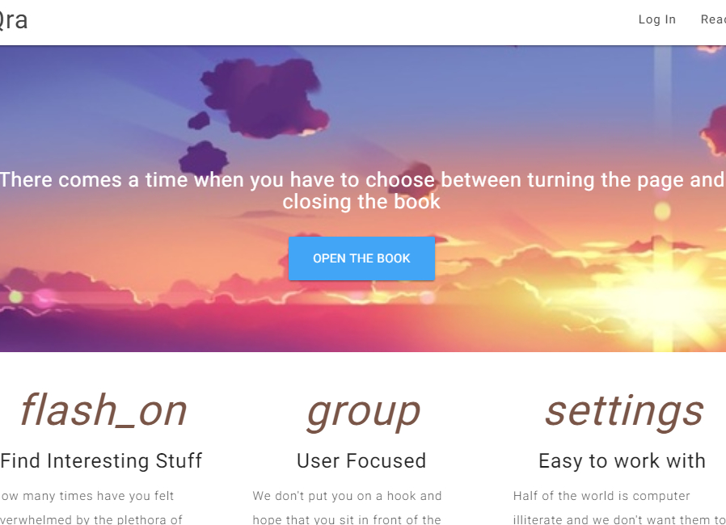
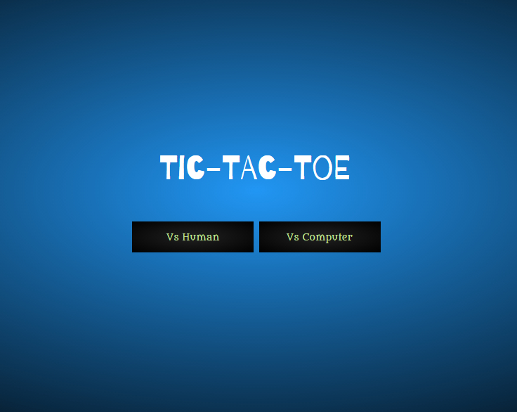
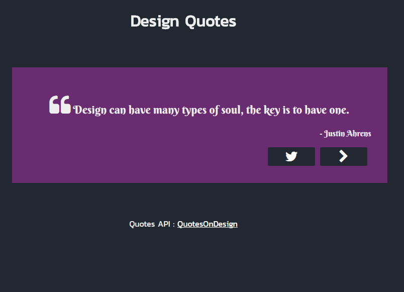
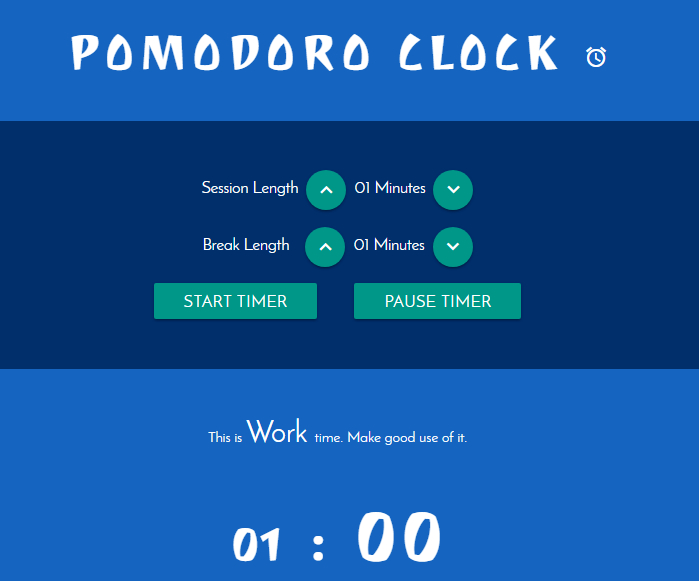

<!-- Main -->

<!--One -->
<section id="one">
	

		<header class="major">
			<h2>Portfolio</h2>
		</header>
		
Works, Experiments – whatever I've done, working on or thinking about.

	

</section>

<!-- Two -->
<section id="two" class="spotlights">
	<section>
		
		

			

				<header class="major">
					<h3>Papel</h3>
				</header>
				
Expense log/manager application written in VueJS and Google Firebase with focus on data sync in parallel usage. Using VueJS makes the application re-render lightening fast.

				<ul class="actions">
					<li><a href="https://github.com/nuhman/papel" class="button">See more</a></li>
				</ul>
			

		

	</section>
	<section>
		
		

			

				<header class="major">
					<h3>React-Youtube</h3>
				</header>
				
Youtube mockoff with functionality to search and watch videos , built using react and youtube api.

				<ul class="actions">
					<li><a href="https://github.com/nuhman/react-youtube" class="button">See more</a></li>
				</ul>
			

		

	</section>
	<section>
		
		

			

				<header class="major">
					<h3>Iqra</h3>
				</header>
				
Content Management System with all CRUD Operations built using PHP & MySQL

				<ul class="actions">
					<li><a href="https://github.com/nuhman/iqra-cms" class="button">Learn more</a></li>
				</ul>
			

		

	</section> <!-- 2nd batch -->	
	<section>
		
		

			

				<header class="major">
					<h3>Tic Tac Toe</h3>
				</header>
				
An unbeateable version of the classic game powered by probablistic algorithm and built using VueJS. You can see it on live action <a href="https://codepen.io/Nuhman/full/zwMPQd">here</a>

				<ul class="actions">
					<li><a href="https://github.com/nuhman/tic-tac-toe" class="button">See more</a></li>
				</ul>
			

		

	</section>
	<section>
		
		

			

				<header class="major">
					<h3>Inspirational Design Quotes</h3>
				</header>
				
A ReactJS application for the inspiring quotes for the designer in you. See it in action <a href="https://codepen.io/Nuhman/full/jaBLbM">here</a>

				<ul class="actions">
					<li><a href="https://github.com/nuhman/quote-machine" class="button">See more</a></li>
				</ul>
			

		

	</section>
	<section>
		
		

			

				<header class="major">
					<h3>Pomodoro Clock</h3>
				</header>
				
A productivity hack <a href="http://codepen.io/Nuhman/full/aWYvjO">application</a> built using VueJS as a part of <a href="https://www.freecodecamp.org/nuhman">FCC</a> certification challenge.

				<ul class="actions">
					<li><a href="https://github.com/nuhman/pomodoro-timer" class="button">Learn more</a></li>
				</ul>
			

		

	</section>
	
	
	
</section>

<!-- Three -->
<!--
<section id="three">
	

		<header class="major">
			<h2>Massa libero</h2>
		</header>
		
Nullam et orci eu lorem consequat tincidunt vivamus et sagittis libero. Mauris aliquet magna magna sed nunc rhoncus pharetra. Pellentesque condimentum sem. In efficitur ligula tate urna. Maecenas laoreet massa vel lacinia pellentesque lorem ipsum dolor. Nullam et orci eu lorem consequat tincidunt. Vivamus et sagittis libero. Mauris aliquet magna magna sed nunc rhoncus amet pharetra et feugiat tempus.

		<ul class="actions">
			<li><a href="generic.html" class="button next">Get Started</a></li>
		</ul>
	

</section> -->

