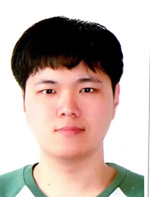

<!-- One -->
<section id="one">
	

		

<h2>Geuntae Park</h2>

B.S in Computer Science, Hanyang University, Seoul, Korea, Feb.2020 
Room 111, R&D Building 
e-mail: qkrrmsxo01@hanyang.ac.kr

<a target="_blank" rel="noopener noreferrer" href="http://cs.hanyang.ac.kr/">Department Of Computer Science</a>
 
<a target="_blank" rel="noopener noreferrer" href="https://www.hanyang.ac.kr/">Hanyang University</a>

	

</section>

## Research Interests
- Data-driven Character Control
- Deep Neural Network

## Publications
**[무게중심을 활용한 모션 생성 기술](https://gitcgr.hanyang.ac.kr/publications/domestic/2020-kcgsjournal-motion-com.pdf)** 
박근태, 손채준, 이윤상 
한국컴퓨터그래픽스학회 논문지, 제 26권 제 2호, 11-19, 2020.06. 
 
**Learning Time-series Interaction Data by Association** 
Geuntae Park, Yoonsang Lee 
ICEIC 2021 