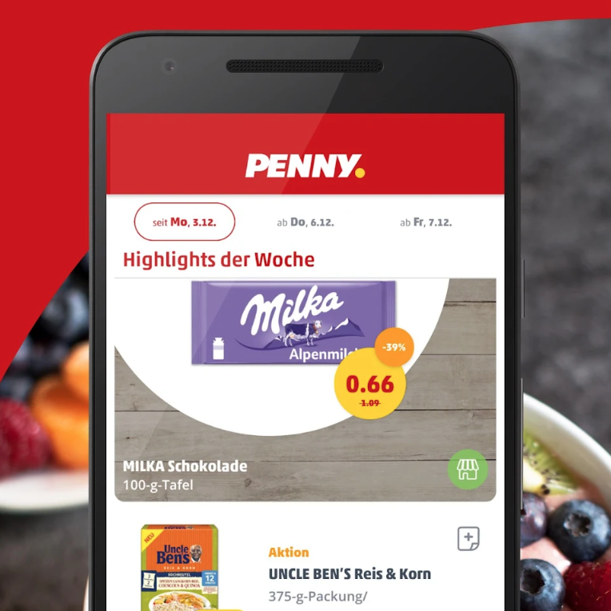
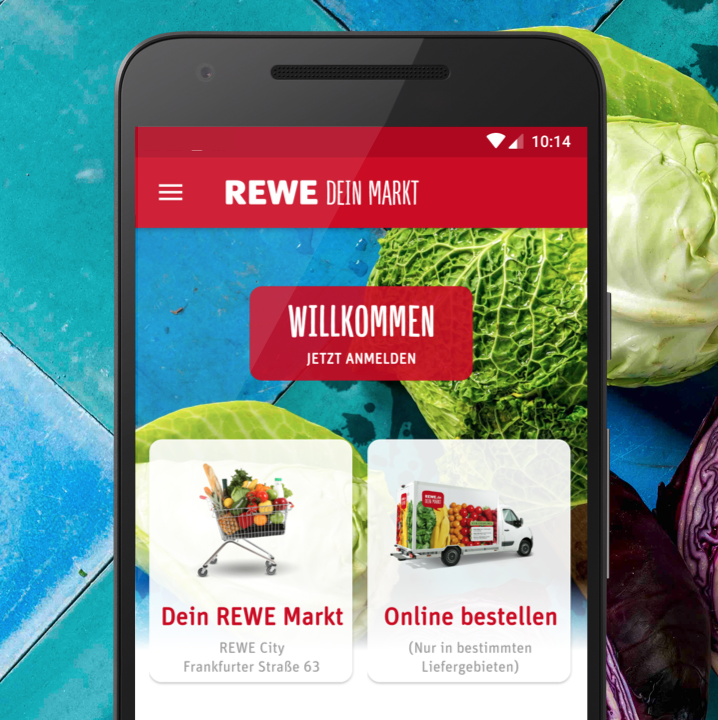

<!-- Main -->

<!-- One -->
<section id="one">
	

		<header class="major">
			<h2>Sed amet aliquam</h2>
		</header>
		
Nullam et orci eu lorem consequat tincidunt vivamus et sagittis magna sed nunc rhoncus condimentum sem. In efficitur ligula tate urna. Maecenas massa vel lacinia pellentesque lorem ipsum dolor. Nullam et orci eu lorem consequat tincidunt. Vivamus et sagittis libero. Nullam et orci eu lorem consequat tincidunt vivamus et sagittis magna sed nunc rhoncus condimentum sem. In efficitur ligula tate urna.

	

</section>

<!-- Two -->
<section id="two" class="spotlights">
	<section>
		
		

			

				<header class="major">
					<h3>PENNY Coupons & Angebote</h3>
				</header>
				
PENNY was built completely from scratch within six months. We aimed to build a showcase for what is possible in Android with the newest features like „Instant Apps“ or modular app design. The app was developed test driven and we also released our own dependency injection framework created within the development of this app.

				<ul class="actions">
					<li>
					<a href="https://play.google.com/store/apps/details?id=de.penny.app" class="button" onclick="ga('send', 'event', {
						'eventCategory': 'Project Links',
  						'eventAction': 'open_penny_link',
						'eventLabel': 'Google Play Store'
					});">Google Play Store</a>
					</li>
				</ul>
			

		

	</section>
	<section>
		
		

			

				<header class="major">
					<h3>REWE Angebote & Lieferservice</h3>
				</header>
				
While working for REWE digital, I added the marketplace feature to the existing app. External vendors were allowed to sell their product through the REWE platform. My team and I introduced clean architecture and the MVP-Pattern within the development time.

				<ul class="actions">
					<li>
					<a href="https://play.google.com/store/apps/details?id=com.rewedigital.shop" class="button" onclick="ga('send', 'event', {
						'eventCategory': 'Project Links',
  						'eventAction': 'open_rewe_link',
						'eventLabel': 'Google Play Store'
					});">Google Play Store</a>
					</li>
				</ul>
			

		

	</section>
	<section>
		
		

			

				<header class="major">
					<h3>Rhoncus magna</h3>
				</header>
				
Nullam et orci eu lorem consequat tincidunt vivamus et sagittis magna sed nunc rhoncus condimentum sem. In efficitur ligula tate urna. Maecenas massa sed magna lacinia magna pellentesque lorem ipsum dolor. Nullam et orci eu lorem consequat tincidunt. Vivamus et sagittis tempus.

				<ul class="actions">
					<li><a href="generic.html" class="button">Learn more</a></li>
				</ul>
			

		

	</section>
	<section>
		
		

			

				<header class="major">
					<h3>Sed nunc ligula</h3>
				</header>
				
Nullam et orci eu lorem consequat tincidunt vivamus et sagittis magna sed nunc rhoncus condimentum sem. In efficitur ligula tate urna. Maecenas massa sed magna lacinia magna pellentesque lorem ipsum dolor. Nullam et orci eu lorem consequat tincidunt. Vivamus et sagittis tempus.

				<ul class="actions">
					<li><a href="generic.html" class="button">Learn more</a></li>
				</ul>
			

		

	</section>
</section>

<!-- Three -->
<section id="three">
	

		<header class="major">
			<h2>Massa libero</h2>
		</header>
		
Nullam et orci eu lorem consequat tincidunt vivamus et sagittis libero. Mauris aliquet magna magna sed nunc rhoncus pharetra. Pellentesque condimentum sem. In efficitur ligula tate urna. Maecenas laoreet massa vel lacinia pellentesque lorem ipsum dolor. Nullam et orci eu lorem consequat tincidunt. Vivamus et sagittis libero. Mauris aliquet magna magna sed nunc rhoncus amet pharetra et feugiat tempus.

		<ul class="actions">
			<li><a href="generic.html" class="button next">Get Started</a></li>
		</ul>
	

</section>

