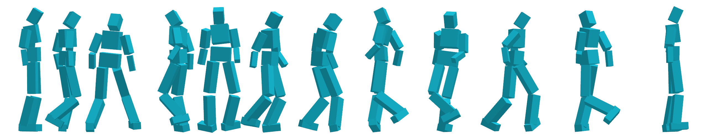

[Yoonsang Lee](../people/yoonsang-lee.html), [Sungeun Kim](http://mrl.snu.ac.kr/~sungeun), [Jehee Lee](http://mrl.snu.ac.kr/~jehee/)  
SIGGRAPH 2010

  
*Our data-driven controller allows the physically-simulated biped character to reproduce challenging motor skills captured in motion data.*

## Abstract
We present a dynamic controller to physically simulate under-actuated three-dimensional full-body biped locomotion. Our data-driven controller takes motion capture reference data to reproduce realistic human locomotion through realtime physically based simulation. The key idea is modulating the reference trajectory continuously and seamlessly such that even a simple dynamic tracking controller can follow the reference trajectory while maintaining its balance. In our framework, biped control can be facilitated by a large array of existing data-driven animation techniques because our controller can take a stream of reference data generated on-the-fly at runtime. We demonstrate the effectiveness of our approach through examples that allow bipeds to turn, spin, and walk while steering its direction interactively. 

## Paper
Download: [pdf](https://gitcgr.hanyang.ac.kr/publications/2010-data-driven/DataDrivenBipedControl_2010.pdf) (1.4MB)

## Video 
<iframe width="1017" height="765" src="https://www.youtube.com/embed/hpeqxc_1vwo" frameborder="0" allow="accelerometer; autoplay; encrypted-media; gyroscope; picture-in-picture" allowfullscreen></iframe>
Full video: [mov](https://gitcgr.hanyang.ac.kr/publications/2010-data-driven/DataDrivenBipedControl_2010.mov) (60.2MB)

Spinning example: 
- original speed - [mov](https://gitcgr.hanyang.ac.kr/publications/2010-data-driven/spin_1x.mov) (1.2MB)
- 1/2 speed - [mov](https://gitcgr.hanyang.ac.kr/publications/2010-data-driven/spin_0.5x.mov) (2.5MB)
- 1/3 speed - [mov](https://gitcgr.hanyang.ac.kr/publications/2010-data-driven/spin_0.33x.mov) (3.8MB)
- 1/4 speed - [mov](https://gitcgr.hanyang.ac.kr/publications/2010-data-driven/spin_0.25x.mov) (4.7MB) 

## Slides
SIGGRAPH 2010 talk slides: [pptx](https://gitcgr.hanyang.ac.kr/publications/2010-data-driven/DataDrivenBipedControl_2010.pptx) (2.3MB, without video) / [zip](https://gitcgr.hanyang.ac.kr/publications/2010-data-driven/with_video.zip) (132.7MB, with video)

## Data
Reference motion capture data : [zip](https://gitcgr.hanyang.ac.kr/publications/2010-data-driven/DataDrivenBipedControl_2010_motion.zip) (0.7MB) 
