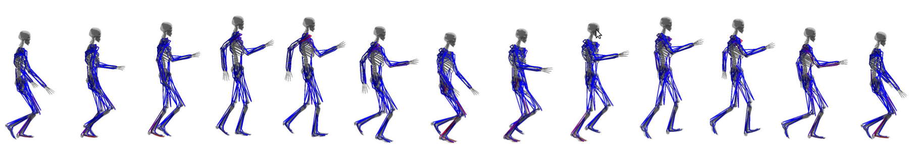

[Yoonsang Lee](../people/yoonsang-lee.html), [Moon Seok Park](https://www.snubh.org/common/layer/drIntroduce.do?sDpCd=OS&sDpCdDtl=OS&sDrSid=1001025&sDrStfNo=65407&sDpTp=), [Taesoo Kwon](http://calab.hanyang.ac.kr/cgi-bin/home.cgi?node=Taesoo), [Jehee Lee](http://mrl.snu.ac.kr/~jehee/)  
SIGGRAPH Asia 2014

  

## Abstract
We present a biped locomotion controller for humanoid models actuated by more than a hundred Hill-type muscles. The key component of the controller is our novel algorithm that can cope with step-based biped locomotion balancing and the coordination of many nonlinear Hill-type muscles simultaneously. Minimum effort muscle activations are calculated based on muscle contraction dynamics and online quadratic programming. Our controller can faithfully reproduce a variety of realistic biped gaits (e.g., normal walk, quick steps, and fast run) and adapt the gaits to varying conditions (e.g., muscle weakness, tightness, joint dislocation, and external pushes) and goals (e.g., pain reduction and efficiency maximization). We demonstrate the robustness and versatility of our controller with examples that can only be achieved using highly-detailed musculoskeletal models with many muscles. 

## Paper
Download: [pdf](https://gitcgr.hanyang.ac.kr/publications/2014-many-muscle/many-muscle.pdf) (11.4MB)

## Video 

 

<iframe width="1280" height="720" src="https://www.youtube.com/embed/O0zxRbZ_kNM" frameborder="0" allow="accelerometer; autoplay; encrypted-media; gyroscope; picture-in-picture" allowfullscreen></iframe>

  
Download: [mp4](https://gitcgr.hanyang.ac.kr/publications/2014-many-muscle/many-muscle.mp4) (52.7MB)

## Supplemental Material 
Download: [pdf](https://gitcgr.hanyang.ac.kr/publications/2014-many-muscle/many-muscle_supp.pdf) (0.9MB)

## Slides
SIGGRAPH Asia 2014 talk slides: [pptx](https://gitcgr.hanyang.ac.kr/publications/2014-many-muscle/many-muscle-slides.pptx) (96.8MB) or [pdf](https://gitcgr.hanyang.ac.kr/publications/2014-many-muscle/many-muscle-slides.pdf) (2.1MB) 

## Data
Humanoid models & Reference motions: [zip](https://gitcgr.hanyang.ac.kr/publications/2014-many-muscle/many-muscle_data.zip) (7.8MB)  
