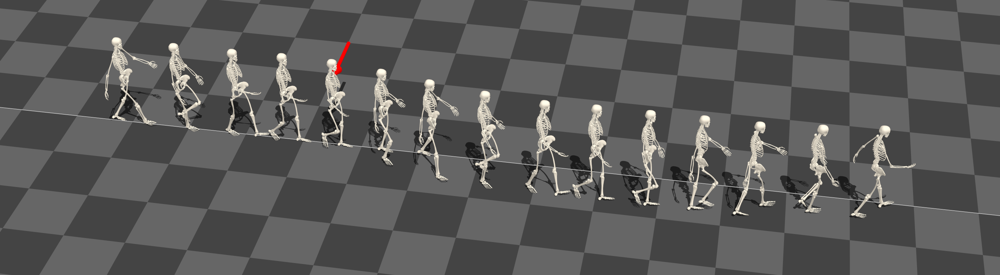

[Yoonsang Lee](../people/yoonsang-lee.html), [Kyungho Lee](http://mrl.snu.ac.kr/~whcjs13/), Soon-Sun Kwon, Jiwon Jeong, [Carol O'Sullivan](http://isg.cs.tcd.ie/cosulliv/), [Moon Seok Park](https://www.snubh.org/common/layer/drIntroduce.do?sDpCd=OS&sDpCdDtl=OS&sDrSid=1001025&sDrStfNo=65407&sDpTp=), [Jehee Lee](http://mrl.snu.ac.kr/~jehee/)  
SIGGRAPH Asia 2015 

  
*Motion capture of our push-recovery experiment. The experimenter pushed the participant while walking and measured lateral detour from the straight line.*

## Abstract
Biped controller design pursues two fundamental goals; simulated walking should look human-like and robust against perturbation while maintaining its balance. Normal gait is a pattern of walking that humans normally adopt in undisturbed situations. It has previously been postulated that normal gait is more energy efficient than abnormal or impaired gaits. However, it is not clear whether normal gait is also superior to abnormal gait patterns with respect to other factors, such as stability. Understanding the correlation between gait and stability is an important aspect of biped controller design. We studied this issue in two sets of experiments with human participants and a simulated biped. The experiments evaluated the degree of resilience to external pushes for various gait patterns. We identified four gait factors that affect the balance-recovery capabilities of both human and simulated walking. We found that crouch gait is significantly more stable than normal gait against lateral push. Walking speed and the timing/magnitude of disturbance also affect gait stability. Our work would provide a potential way to  compare the performance of biped controllers by normalizing their output gaits and improve their performance by adjusting these decisive factors. 

## Paper
Download: [pdf](https://gitcgr.hanyang.ac.kr/publications/2015-push-recovery/push-recovery.pdf) (5.0MB)

## Video 

 

<iframe width="1280" height="720" src="https://www.youtube.com/embed/KrTDh5Zhlac" frameborder="0" allow="accelerometer; autoplay; encrypted-media; gyroscope; picture-in-picture" allowfullscreen></iframe>

  
Download: [mp4](https://gitcgr.hanyang.ac.kr/publications/2015-push-recovery/push-recovery.mp4) (69.3MB)

## Slides
SIGGRAPH Asia 2015 talk slides: [pptx](https://gitcgr.hanyang.ac.kr/publications/2015-push-recovery/push-recovery-slides.pptx) (127.2MB) or [pdf](https://gitcgr.hanyang.ac.kr/publications/2015-push-recovery/push-recovery-slides.pdf) (1.6MB) 

## Data
Human & simulation measurement data : [zip](https://gitcgr.hanyang.ac.kr/publications/2015-push-recovery/push-recovery-data.zip) (1.2MB)  
Motion capture data from the human experiments : [zip](https://gitcgr.hanyang.ac.kr/publications/2015-push-recovery/push-recovery-mocap.zip) (94.5MB)  
